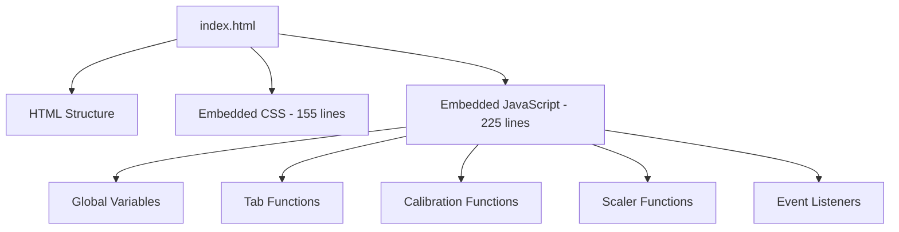
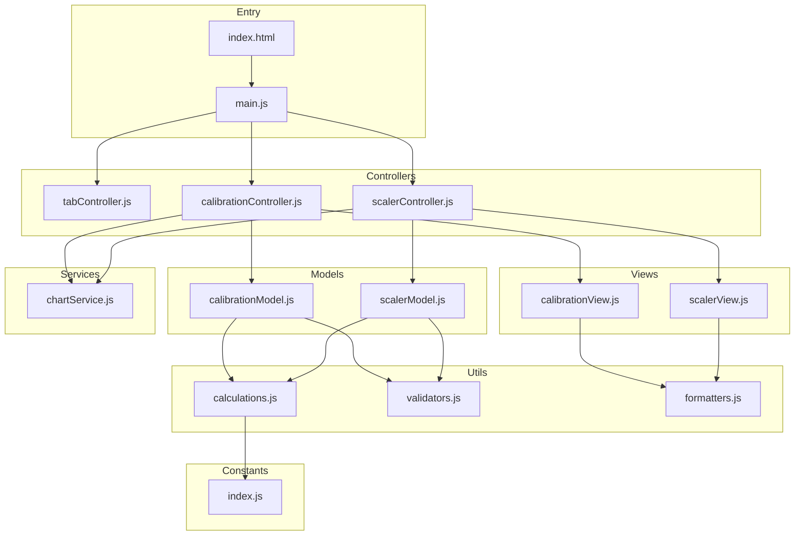

# Industrial mA Converter - Architecture Refactoring Proposal

## Executive Summary

The current [`index.html`](index.html) is a monolithic single-file application containing ~500 lines of mixed HTML, CSS, and JavaScript. This document proposes a modern, maintainable architecture following engineering best practices.

---

## Current State Analysis

### Issues Identified

| Issue | Description | Impact |
|-------|-------------|--------|
| **Monolithic File** | All code in single HTML file | Hard to navigate, maintain, and debug |
| **Global Scope Pollution** | Variables like `calibrationChart`, `scalerChart` in global scope | Risk of naming collisions, hard to test |
| **Tight Coupling** | Functions directly access DOM by ID | Cannot reuse logic, hard to refactor |
| **Inline Event Handlers** | `onclick="switchTab('scaler')"` in HTML | Mixes behavior with structure |
| **No Separation of Concerns** | Business logic mixed with DOM manipulation | Cannot unit test calculations |
| **No Build Process** | No minification or bundling | Larger payload, no optimization |
| **Magic Numbers** | Hardcoded values like `4`, `20`, `1.00` | Hard to maintain and understand |

### Current Code Structure



---

## Proposed Architecture

### Design Principles

1. **Separation of Concerns** - HTML, CSS, and JS in separate files
2. **Single Responsibility** - Each module handles one concern
3. **Dependency Injection** - Pass dependencies rather than hardcoding
4. **Testability** - Pure functions for business logic
5. **Modularity** - ES6 modules for code organization
6. **Maintainability** - Clear naming, documentation, and structure

### Proposed File Structure

```
Industrial-mA-Converter/
├── index.html                 # Minimal HTML entry point
├── package.json               # Dependencies and scripts
├── vite.config.js            # Build configuration
├── src/
│   ├── main.js               # Application entry point
│   ├── styles/
│   │   ├── main.css          # Main stylesheet
│   │   ├── variables.css     # CSS custom properties
│   │   ├── components/
│   │   │   ├── tabs.css
│   │   │   ├── forms.css
│   │   │   ├── tables.css
│   │   │   └── charts.css
│   │   └── utilities.css     # Helper classes
│   ├── modules/
│   │   ├── tabController.js   # Tab switching logic
│   │   ├── calibration/
│   │   │   ├── calibrationController.js
│   │   │   ├── calibrationModel.js
│   │   │   └── calibrationView.js
│   │   └── scaler/
│   │       ├── scalerController.js
│   │       ├── scalerModel.js
│   │       └── scalerView.js
│   ├── services/
│   │   └── chartService.js    # Chart.js wrapper
│   ├── utils/
│   │   ├── calculations.js    # Pure calculation functions
│   │   ├── validators.js      # Input validation
│   │   └── formatters.js      # Number formatting
│   └── constants/
│       └── index.js           # Application constants
└── tests/
    ├── calculations.test.js
    └── validators.test.js
```

### Architecture Diagram



---

## Module Design Details

### 1. Constants Module

```javascript
// src/constants/index.js
export const MA_RANGES = {
  '4-20': { min: 4, max: 20 },
  '0-20': { min: 0, max: 20 }
};

export const DEFAULT_CALIBRATION = {
  factor: 1.00,
  offset: 0.00
};

export const CHART_COLORS = {
  ideal: 'rgb(75, 192, 192)',
  actual: 'rgb(255, 99, 132)',
  corrected: 'rgb(255, 205, 86)',
  scaler: 'rgb(54, 162, 235)'
};
```

### 2. Calculations Module - Pure Functions

```javascript
// src/utils/calculations.js
import { MA_RANGES } from '../constants/index.js';

/**
 * Convert parameter value to mA
 * @param {number} paramValue - The parameter value
 * @param {number} paramMin - Parameter minimum
 * @param {number} paramMax - Parameter maximum
 * @param {string} maRangeKey - mA range key - 4-20 or 0-20
 * @returns {number} mA value
 */
export function parameterToMa(paramValue, paramMin, paramMax, maRangeKey) {
  const range = MA_RANGES[maRangeKey];
  return (paramValue - paramMin) * (range.max - range.min) / (paramMax - paramMin) + range.min;
}

/**
 * Convert mA value to parameter
 * @param {number} maValue - The mA value
 * @param {number} paramMin - Parameter minimum
 * @param {number} paramMax - Parameter maximum
 * @param {string} maRangeKey - mA range key
 * @returns {number} Parameter value
 */
export function maToParameter(maValue, paramMin, paramMax, maRangeKey) {
  const range = MA_RANGES[maRangeKey];
  return (maValue - range.min) * (paramMax - paramMin) / (range.max - range.min) + paramMin;
}

/**
 * Apply calibration correction
 * @param {number} actual - Actual measured value
 * @param {number} factor - Calibration factor
 * @param {number} offset - Calibration offset
 * @returns {number} Corrected value
 */
export function applyCorrection(actual, factor, offset) {
  return actual * factor + offset;
}

/**
 * Calculate slope between two points
 * @param {number} output1 - First output value
 * @param {number} output2 - Second output value
 * @param {number} actual1 - First actual value
 * @param {number} actual2 - Second actual value
 * @returns {number} Slope
 */
export function calculateSlope(output1, output2, actual1, actual2) {
  return (actual2 - actual1) / (output2 - output1);
}
```

### 3. Model Layer

```javascript
// src/modules/scaler/scalerModel.js
import { parameterToMa, maToParameter } from '../../utils/calculations.js';

export class ScalerModel {
  constructor() {
    this.maRangeKey = '4-20';
    this.paramMin = null;
    this.paramMax = null;
    this.inputValue = null;
    this.inputType = 'parameter-to-ma';
  }

  setMaRange(key) {
    this.maRangeKey = key;
  }

  setParameterRange(min, max) {
    this.paramMin = min;
    this.paramMax = max;
  }

  setInputValue(value, type) {
    this.inputValue = value;
    this.inputType = type;
  }

  calculate() {
    if (this.paramMin === null || this.paramMax === null || this.inputValue === null) {
      return null;
    }

    if (this.inputType === 'parameter-to-ma') {
      return {
        type: 'ma',
        value: parameterToMa(this.inputValue, this.paramMin, this.paramMax, this.maRangeKey)
      };
    } else {
      return {
        type: 'parameter',
        value: maToParameter(this.inputValue, this.paramMin, this.paramMax, this.maRangeKey)
      };
    }
  }

  getGraphData(steps = 20) {
    // Returns array of {x, y} points for graphing
    // ...
  }
}
```

### 4. View Layer

```javascript
// src/modules/scaler/scalerView.js
export class ScalerView {
  constructor(elements) {
    this.elements = elements;
  }

  bindInputChange(handler) {
    this.elements.maRange.addEventListener('change', handler);
    this.elements.paramMin.addEventListener('input', handler);
    this.elements.paramMax.addEventListener('input', handler);
    this.elements.inputValue.addEventListener('input', handler);
    this.elements.inputType.addEventListener('change', handler);
  }

  updateInputLabel(type) {
    const label = this.elements.inputLabel;
    const input = this.elements.inputValue;
    
    if (type === 'parameter-to-ma') {
      label.textContent = 'Parameter Value:';
      input.placeholder = 'Enter parameter value';
    } else {
      label.textContent = 'mA Value:';
      input.placeholder = 'Enter mA value';
    }
  }

  showResult(result) {
    this.elements.result.style.display = 'block';
    this.elements.result.innerHTML = 
      `<strong>Result:</strong> ${result.value.toFixed(3)} ${result.type === 'ma' ? 'mA' : '(parameter value)'}`;
  }

  hideResult() {
    this.elements.result.style.display = 'none';
  }
}
```

### 5. Controller Layer

```javascript
// src/modules/scaler/scalerController.js
import { ScalerModel } from './scalerModel.js';
import { ScalerView } from './scalerView.js';
import { ChartService } from '../../services/chartService.js';

export class ScalerController {
  constructor(view, model, chartService) {
    this.view = view;
    this.model = model;
    this.chartService = chartService;
    
    this.view.bindInputChange(this.handleInputChange.bind(this));
  }

  handleInputChange() {
    // Update model from view
    // Calculate results
    // Update view with results
    // Update chart
  }
}
```

---

## CSS Architecture

### CSS Custom Properties

```css
/* src/styles/variables.css */
:root {
  /* Colors */
  --color-bg-primary: #1a1a1a;
  --color-bg-secondary: #2d2d2d;
  --color-bg-tertiary: #1f1f1f;
  --color-text-primary: #e0e0e0;
  --color-text-secondary: #b0b0b0;
  --color-text-muted: #808080;
  --color-accent: #4fc3f7;
  --color-accent-hover: #29b6f6;
  --color-warning: #ffa726;
  --color-border: #404040;
  
  /* Spacing */
  --spacing-xs: 5px;
  --spacing-sm: 10px;
  --spacing-md: 15px;
  --spacing-lg: 20px;
  
  /* Border Radius */
  --radius-sm: 4px;
  --radius-md: 8px;
  
  /* Typography */
  --font-family: Arial, sans-serif;
  --font-size-sm: 12px;
  --font-size-base: 16px;
  --font-size-lg: 24px;
}
```

### Component-Based CSS

```css
/* src/styles/components/tabs.css */
.tabs {
  display: flex;
  border-bottom: 2px solid var(--color-bg-primary);
  background-color: var(--color-bg-tertiary);
}

.tab {
  flex: 1;
  padding: var(--spacing-md);
  text-align: center;
  cursor: pointer;
  background-color: var(--color-bg-tertiary);
  border: none;
  font-size: var(--font-size-base);
  font-weight: bold;
  color: var(--color-text-muted);
  transition: all 0.3s;
}

.tab:hover {
  background-color: #252525;
  color: var(--color-text-secondary);
}

.tab.active {
  background-color: var(--color-bg-secondary);
  color: var(--color-accent);
  border-bottom: 3px solid var(--color-accent);
}
```

---

## Build Tool Options

### Recommended: Vite

**Why Vite:**
- Zero configuration needed
- Fast development server with HMR
- Native ES modules support
- Optimized production builds
- Simple setup

```json
// package.json
{
  "name": "industrial-ma-converter",
  "version": "1.0.0",
  "type": "module",
  "scripts": {
    "dev": "vite",
    "build": "vite build",
    "preview": "vite preview",
    "test": "vitest"
  },
  "devDependencies": {
    "vite": "^5.0.0",
    "vitest": "^1.0.0"
  },
  "dependencies": {
    "chart.js": "^4.0.0"
  }
}
```

### Alternative: Vanilla JS with ES Modules

If build tools are not desired, use native ES modules:

```html
<script type="module" src="src/main.js"></script>
```

---

## Implementation Roadmap

### Phase 1: Setup and Structure
- [ ] Initialize npm project with package.json
- [ ] Set up Vite configuration
- [ ] Create folder structure
- [ ] Extract CSS to separate files
- [ ] Extract JavaScript to modules

### Phase 2: Core Refactoring
- [ ] Create constants module
- [ ] Create utility functions with pure calculations
- [ ] Implement Model classes
- [ ] Implement View classes
- [ ] Implement Controller classes
- [ ] Create ChartService

### Phase 3: Testing and Quality
- [ ] Add unit tests for calculations
- [ ] Add input validation
- [ ] Add error handling
- [ ] Add JSDoc documentation

### Phase 4: Polish
- [ ] Optimize CSS with custom properties
- [ ] Add accessibility improvements
- [ ] Add responsive design improvements
- [ ] Create production build

---

## Benefits of Proposed Architecture

| Benefit | Description |
|---------|-------------|
| **Testability** | Pure functions can be unit tested independently |
| **Maintainability** | Clear separation makes changes localized |
| **Reusability** | Modules can be reused in other projects |
| **Debuggability** | Easier to trace issues in modular code |
| **Scalability** | Easy to add new features or tabs |
| **Team Collaboration** | Different developers can work on different modules |
| **Performance** | Build tools optimize and minify code |

---

## Build Tool Tradeoffs Analysis

### Option A: Vite (Build Tool)

```
Development Workflow:
npm install → npm run dev → npm run build
```

| Aspect | Details |
|--------|---------|
| **Pros** | Hot Module Replacement (HMR), fast builds, minification, bundling, tree-shaking, source maps, easy testing setup |
| **Cons** | Requires Node.js, requires npm install, adds node_modules folder, build step required for deployment |
| **Bundle Size** | Smaller (minified + tree-shaken) |
| **Dev Experience** | Excellent (HMR, fast refresh) |
| **Deployment** | Requires build step, outputs to dist/ folder |
| **Learning Curve** | Low (minimal config needed) |

**Best for**: Projects that may grow, teams, production apps, when you want optimizations

### Option B: Vanilla ES Modules (No Build)

```
Development Workflow:
Open index.html in browser (or use simple server)
```

| Aspect | Details |
|--------|---------|
| **Pros** | No dependencies, no build step, works immediately, simpler project structure |
| **Cons** | No minification, no bundling, no tree-shaking, separate HTTP requests per file |
| **Bundle Size** | Larger (no minification) + multiple requests |
| **Dev Experience** | Good (but requires server for modules) |
| **Deployment** | Simple file copy, no build needed |
| **Learning Curve** | None (standard JavaScript) |

**Best for**: Simple projects, quick prototypes, when you want zero dependencies

### Comparison Matrix

| Feature | Vite | Vanilla ES Modules |
|---------|------|-------------------|
| Setup complexity | Medium (package.json, node_modules) | Low (just files) |
| Development speed | Fast (HMR) | Medium (manual refresh) |
| Production bundle | Optimized | Unoptimized |
| Dependencies | Requires Node.js | None |
| Testing | Easy (Vitest) | Manual or separate setup |
| TypeScript support | Built-in | Not available |
| Browser support | All (transpiled) | Modern only |
| Deployment | Build required | Direct copy |

### Recommendation

For this project, I recommend **Vite** because:
1. The project has clear module boundaries that benefit from bundling
2. Easy to add unit tests later with Vitest
3. Can add TypeScript later if desired
4. Production builds will be smaller and faster
5. Hot Module Replacement improves development experience

However, **Vanilla ES Modules** is a valid choice if:
1. You want zero dependencies
2. The project will remain small
3. You prefer the simplest possible setup
4. You don't need testing infrastructure

---

## Questions for Discussion

1. **Build Tool Preference**: Would you prefer Vite, or would you like to keep it simple with native ES modules?

2. **Testing Framework**: Would you like to include unit tests with Vitest, or skip testing for now?

3. **TypeScript**: Would you like to add TypeScript for type safety?

4. **Additional Features**: Are there any planned features that should influence the architecture?

5. **Browser Support**: What browsers need to be supported? This affects build configuration.
